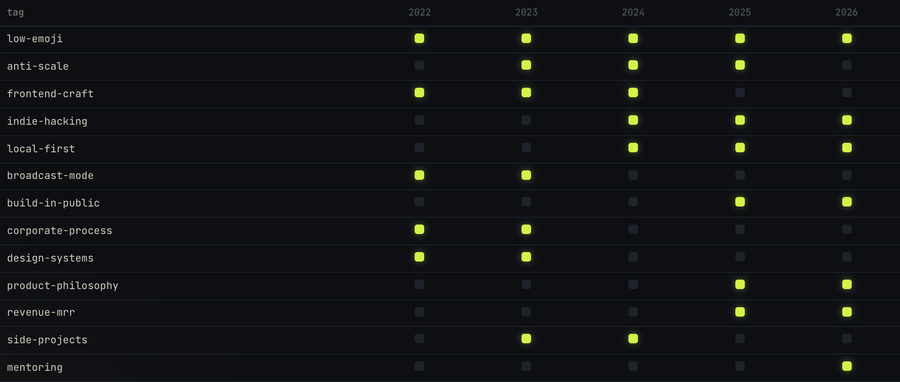
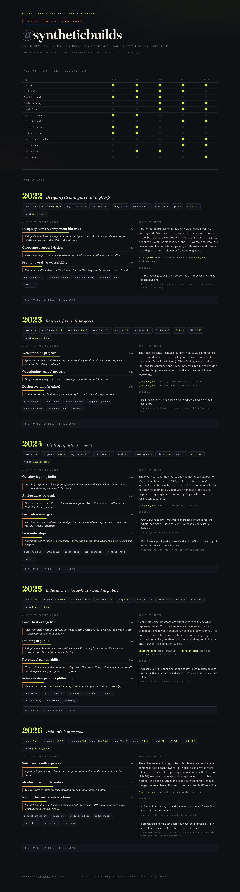

# x-persona

**Read an X/Twitter account the way you'd study a person — not the way you'd score a personality quiz.**

Given a corpus of one account's tweets, x-persona builds a deep, evidence-grounded profile of how they think, how they speak, what they engage with, and **how all of it has changed over the years** — every claim backed by a verbatim tweet.



*Above: the tag-over-time matrix from the annual report — a synthetic demo account pivoting from a corporate-frontend era to an indie/local-first era. ([live demo](https://jianqiu-kakoi.github.io/x-persona-skill/report.html) · synthetic data)*

- **How they think** — mental models, core beliefs (with confidence), reasoning style, blind spots and internal tensions.
- **How they speak** — register, signature rhetorical devices, vocabulary, sentence patterns, plus a reusable `imitation_prompt`.
- **What they engage with** — weighted topic clusters with their *angle* on each, and who they amplify or argue with.
- **How it changed** — a longitudinal report: per-year + per-month breakdown, dated shifts, and a tag matrix tracking what rose and fell.

## Why it's different

The "personality from tweets" space is crowded at the shallow end — viral toys that hand you trait adjectives, and Big-Five scorers that hand you OCEAN numbers. Two things those don't do, and this does:

1. **Depth of thinking** — captures *how someone reasons* (their models, not "you're 78% open"), enough to anticipate how they'd react to something new.
2. **Trajectory over time** — captures *how an account evolved* across years. This axis is essentially unoccupied by existing products.

It's a **depth tool**: it reads a full timeline (often 100k+ tokens), built for understanding one account well — not instant mass readouts.

## Two outputs

- **Dossier** — one holistic profile JSON ([`output.schema.json`](skills/x-persona/output.schema.json)): mind, voice, terrain, arc.
- **Annual + monthly report** — a time-series breakdown ([`timeline/schema.json`](skills/x-persona/timeline/schema.json)) with computed style metrics, content themes, tags, and the tag-over-time matrix shown above.



## How it works

A two-layer, map-reduce pipeline — cheap exact stats underneath, LLM reading on top:

```
corpus.json
  ├─ period_stats.mjs ───────────► exact per-year/month metrics, no LLM
  │     (sentence length, emoji/hashtag/link/reply rates, vocabulary richness…)
  └─ split by year
        → [ one LLM reader per year ] ......... map (parallel; Sonnet works well)
              → content themes · free tags · voice reading · monthly drill-down
        → unify all free tags → canonical taxonomy ............ reduce
        → assemble_report.mjs → report.json → report.html
```

The deterministic layer is exact and free; the LLM layer adds interpretation. Tags are generated freely per year, then unified into one taxonomy so a tag's rise/fall is trackable across time.

## Usage

### 1. Get a corpus

Use the bundled **official X API adapter** — bring your own X API credentials and pull a timeline into the corpus shape:

```bash
# put X_API_KEY + X_API_SECRET (or X_BEARER_TOKEN) in .env — see .env.example
node --env-file=.env skills/x-persona/scripts/fetch_xapi.mjs <handle> > corpus.json
```

It uses the sanctioned X API v2 (the official user-timeline returns the most recent ~3,200 tweets). The output is a JSON array shaped like [`corpus.schema.json`](skills/x-persona/corpus.schema.json) (sample: [`examples/synthetic-account.json`](examples/synthetic-account.json)):

```json
[ { "id": "...", "text": "...", "created_at": "2025-07-22T17:33:00.000Z", "is_retweet": false, "is_reply": false, "lang": "en" } ]
```

Want full history instead of the ~3,200 cap, or a different source? Supply your own corpus matching the schema — e.g. your **X data export** (Settings → *Download an archive of your data*). `created_at` must be ISO 8601 (the year/month analysis sorts on it). The analysis skill itself never fetches; acquisition is a separate, swappable step.

### 2. Run it

- **Dossier:** point a skill-aware Claude (e.g. Claude Code) at this skill + your `corpus.json`; it follows [`prompt.md`](skills/x-persona/prompt.md) and returns a profile matching [`output.schema.json`](skills/x-persona/output.schema.json).
- **Timeline report:** `node skills/x-persona/scripts/period_stats.mjs corpus.json > stats.json`, run a per-year reader over each year ([`timeline/prompt.md`](skills/x-persona/timeline/prompt.md)), then `node skills/x-persona/scripts/assemble_report.mjs stats.json <readers-out-dir> [tagmap.json] > report.json`. Open `report.html` to view it.

## Demo pages

Static, no backend — host on GitHub Pages or serve locally (`python3 -m http.server`).

- [`index.html`](index.html) — landing page.
- [`report.html`](report.html) — the report viewer; renders [`examples/synthetic-report.json`](examples/synthetic-report.json) by default, or any report via `report.html?src=path/to/report.json`.

All demo data is **synthetic** — `@syntheticbuilds` is a fabricated account, clearly marked in the viewer.

## Responsible use

This profiles real people from public posts. Use it where you have a legitimate reason — a public figure, a counterpart you're engaging, a competitor's public stance, or yourself — and respect the platform's terms and applicable privacy law (e.g. GDPR-style data rights). **Don't** use it to harass, dox, surveil private individuals, or profile people without a legitimate basis. Treat any corpus or generated profile as sensitive and keep it private by default. This repo ships **no real-person data** — only synthetic examples.

## Roadmap

- **Media (video / voice / images).** Today only tweet text is analyzed; a video tweet contributes its caption, not the spoken content. A corpus could be enriched by transcribing attached audio/video (e.g. Whisper) before analysis. Text-first by design.

## License

[MIT](LICENSE).
